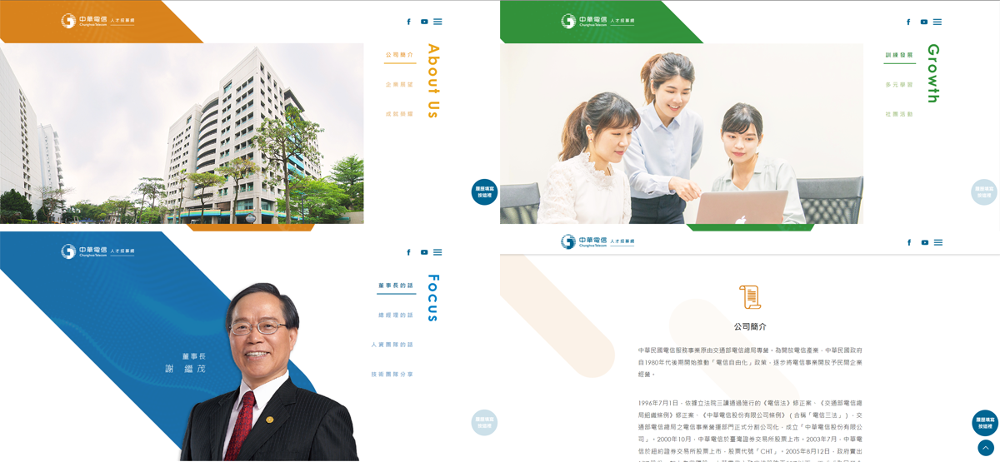
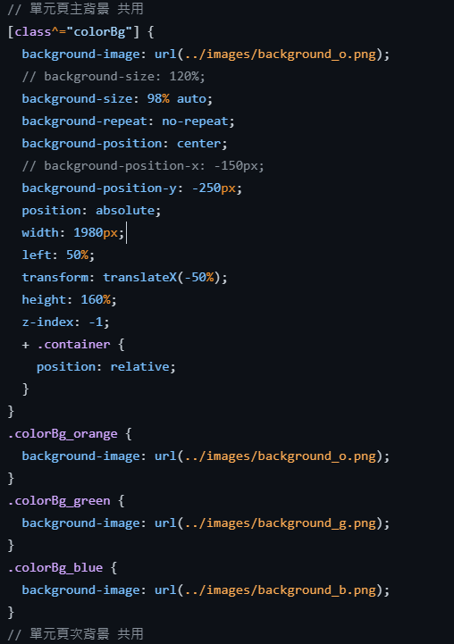
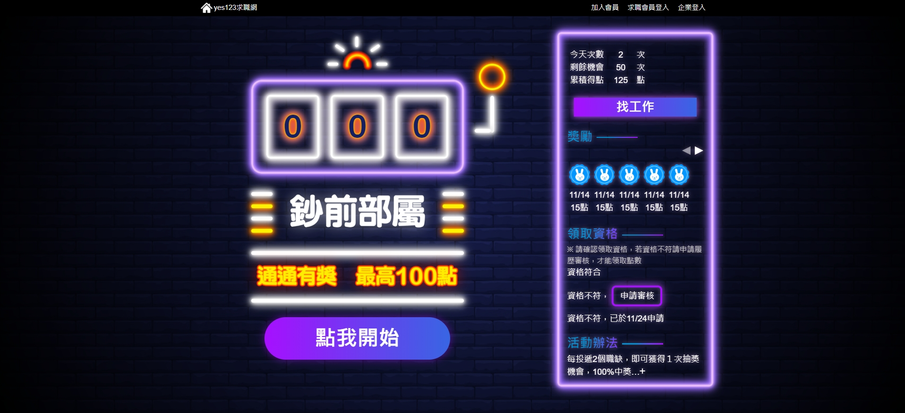

# 郭佳昀(May Kuo)

- 生日: 1994/07/09
- 學歷: 康寧大學 應用日文系 輔修資傳系
- E-mail: kuo.CY.may@gmail.com
- 聯繫方式: 0966-668-017

## 作品集
### 1. [中華電信_人才招募網](https://github.com/KakuKain/portfolio/tree/main/CHT_company%20cultures){:target="_blank"}
 
 - 與設計協調網頁一致性，並進行模組化，使專案方便維護，並加速新增頁面的速度
 

### 2. [yes123_首頁](https://github.com/KakuKain/portfolio/tree/main/yes123_index){:target="_blank"}

- 將搜尋欄製作為可切換兩種模式，使文字等可以配合底圖色系變成一般模式或是白字模式

### 3. [yes123_錢幣雨特效](https://www.example.com](https://www.yes123.com.tw/wk_index/joblist.asp?find_key1=%E5%B9%B4%E5%BE%8C%E4%B8%8A%E7%8F%AD)https://www.yes123.com.tw/wk_index/joblist.asp?find_key1=%E5%B9%B4%E5%BE%8C%E4%B8%8A%E7%8F%AD){:target="_blank"}

- 在搜尋頁新增 banner 和錢幣雨的特效來凸顯可年後上班的不同

### 4. [yes123_sp鈔前部屬](https://github.com/KakuKain/portfolio/tree/main/yes123_sp01){:target="_blank"}

- 霓虹燈效果完全使用 css 不使用圖片，來提升快網站瀏覽的速度

### 5. [yes123_商店芸](https://github.com/KakuKain/portfolio/blob/main/yes123_shop%20cloud/merchandise.html){:target="_blank"}

- 建立網頁結構
- 商品頁只寫一塊 html 就可以切換 3 種呈現模式

